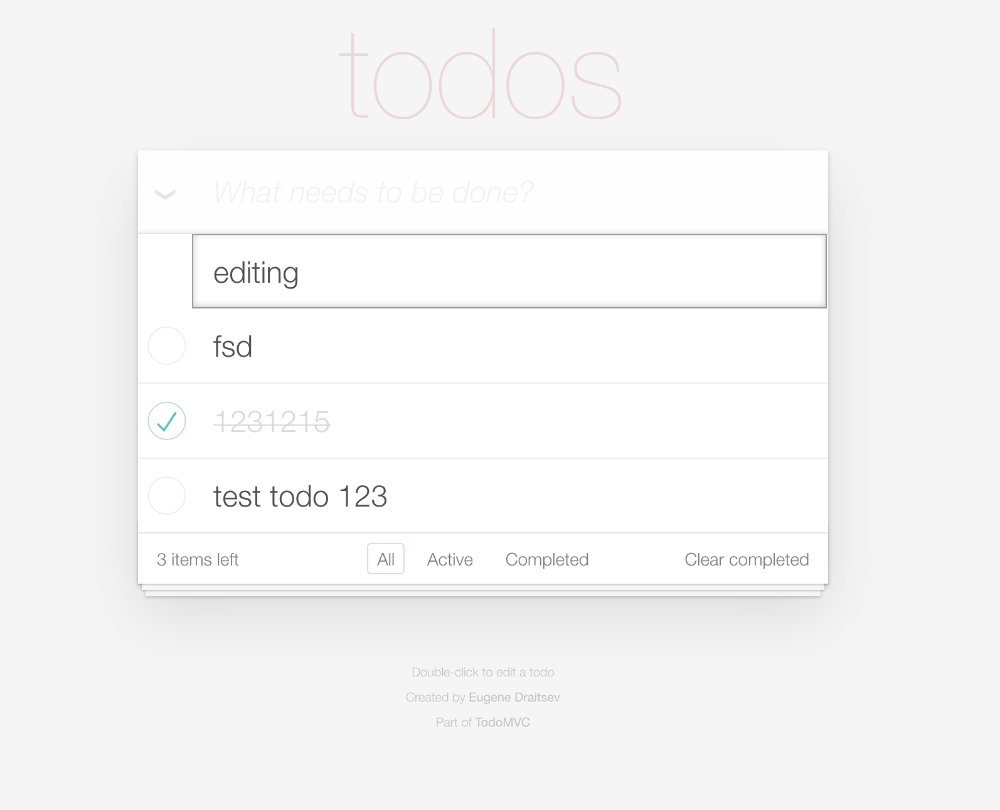

## Rxjs6 TodoMVC Implementation

**Demo:** [https://todomvc-rxjs6.surge.sh](http://todomvc-rxjs6.surge.sh)

Simple implementation of [TodoMVC](http://todomvc.com/) with rxjs6 and native js


To run it locally just clone this repo and run:
```
yarn
yarn start
```




